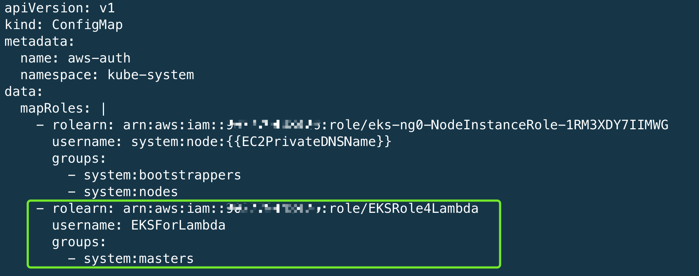
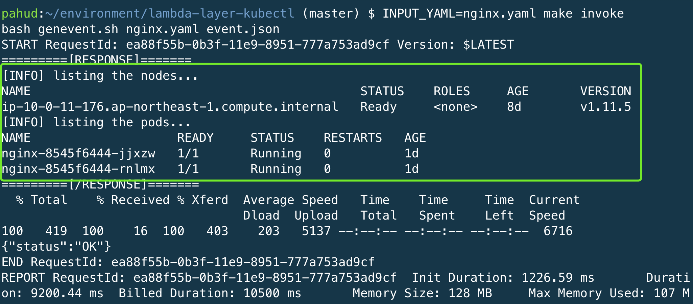
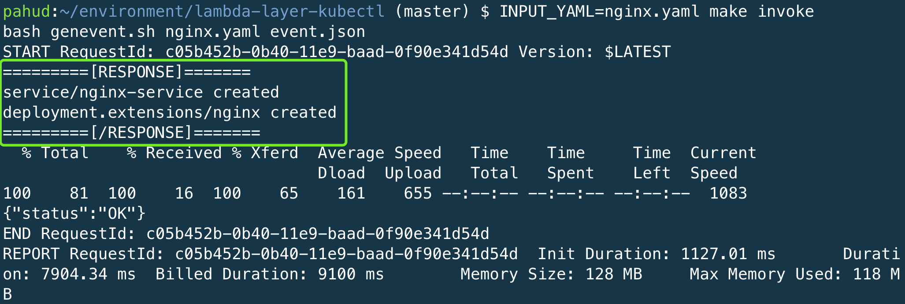
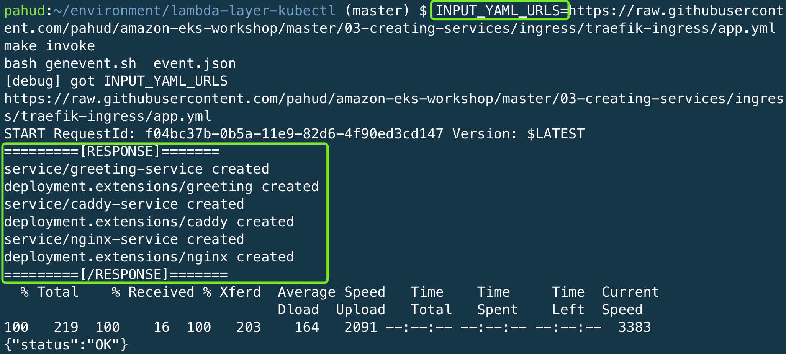
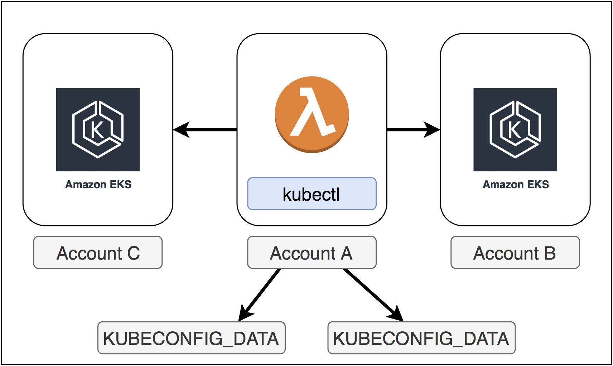

[](https://serverlessrepo.aws.amazon.com/applications/arn:aws:serverlessrepo:us-east-1:903779448426:applications~lambda-layer-kubectl)


# lambda-layer-kubectl

**aws-lambda-layer-kubectl** is an [AWS Lambda Layer](https://docs.aws.amazon.com/en_us/lambda/latest/dg/configuration-layers.html) that encapsulates all the required assets to interact with **Amazon EKS** control plane and help you directly **`kubectl`** against Amazon EKS in AWS Lambda. You could just write 2~5 lines of shell script and it takes all the rest for you while your code size could minimize down to [1.5KB only](https://twitter.com/pahudnet/status/1078563515898707968).


# Features

- [x] Ships all the required assests including `kubectl`, `aws` CLI and `jq`. Just include the layer and you get everything required.
- [x] It takes care of the Amazon EKS authentication behind the scene.
- [x] Straight `kubectl` against Amazon EKS without `client-go` or python client SDK for K8s. Zero code experience required. Just shell script.
- [x] Invoke your Lambda function with any `yaml` file from local and it can `kubectl apply -f` for you to apply it on Amazon EKS.

# Layer structure

You got the layer structure as below under `/opt` in lambda custom runtime:

```
.
├── awscli
│   ├── aws
│   ├── awscli
│   ├── awscli-1.16.161-py2.7.egg-info
│   ├── bin
│   ├── botocore
│   ├── botocore-1.12.151-py2.7.egg-info
│   ├── colorama
│   ├── colorama-0.3.9-py2.7.egg-info
│   ├── concurrent
│   ├── dateutil
│   ├── docutils
│   ├── docutils-0.14-py2.7.egg-info
│   ├── easy_install.py
│   ├── easy_install.pyc
│   ├── futures-3.2.0-py2.7.egg-info
│   ├── jmespath
│   ├── jmespath-0.9.4-py2.7.egg-info
│   ├── jq
│   ├── make
│   ├── pkg_resources
│   ├── pyasn1
│   ├── pyasn1-0.4.5-py2.7.egg-info
│   ├── python_dateutil-2.8.0-py2.7.egg-info
│   ├── PyYAML-3.13-py2.7.egg-info
│   ├── rsa
│   ├── rsa-3.4.2-py2.7.egg-info
│   ├── s3transfer
│   ├── s3transfer-0.2.0-py2.7.egg-info
│   ├── six-1.12.0-py2.7.egg-info
│   ├── six.py
│   ├── six.pyc
│   ├── urllib3
│   ├── urllib3-1.24.3-py2.7.egg-info
│   ├── wheel
│   ├── wheel-0.29.0.dist-info
│   └── yaml
└── kubectl
    └── kubectl

31 directories, 8 files
```


# HOWTO

You may install the Layer from `SAR` or just build it from scratch.


## OPTION #1 - Install from SAR(Serverless App Repository)

This is the recommended approach. We deploy the kubectl lambda layer straight from `SAR(Serverless App Repository)`

You may deploy from the console or from the command line.

### Deploy from SAR console

|        Region        |                    Click and Deploy                     | 
| :----------------: | :----------------------------------------------------------: | 
|  **ap-northeast-1**  |[](https://deploy.serverlessrepo.app/ap-northeast-1/?app=arn:aws:serverlessrepo:us-east-1:903779448426:applications/lambda-layer-kubectl)|
|  **ap-northeast-2**  |[](https://deploy.serverlessrepo.app/ap-northeast-2/?app=arn:aws:serverlessrepo:us-east-1:903779448426:applications/lambda-layer-kubectl)|
|  **ap-northeast-3**  |[](https://deploy.serverlessrepo.app/ap-northeast-3/?app=arn:aws:serverlessrepo:us-east-1:903779448426:applications/lambda-layer-kubectl)|
|  **ap-south-1**  |[](https://deploy.serverlessrepo.app/ap-south-1/?app=arn:aws:serverlessrepo:us-east-1:903779448426:applications/lambda-layer-kubectl)|
|  **ap-southeast-1**  |[](https://deploy.serverlessrepo.app/ap-southeast-1/?app=arn:aws:serverlessrepo:us-east-1:903779448426:applications/lambda-layer-kubectl)|
|  **ap-southeast-2**  |[](https://deploy.serverlessrepo.app/ap-southeast-2/?app=arn:aws:serverlessrepo:us-east-1:903779448426:applications/lambda-layer-kubectl)|
|  **ca-central-1**  |[](https://deploy.serverlessrepo.app/ca-central-1/?app=arn:aws:serverlessrepo:us-east-1:903779448426:applications/lambda-layer-kubectl)|
|  **eu-central-1**  |[](https://deploy.serverlessrepo.app/eu-central-1/?app=arn:aws:serverlessrepo:us-east-1:903779448426:applications/lambda-layer-kubectl)|
|  **eu-north-1**  |[](https://deploy.serverlessrepo.app/eu-north-1/?app=arn:aws:serverlessrepo:us-east-1:903779448426:applications/lambda-layer-kubectl)|
|  **eu-west-1**  |[](https://deploy.serverlessrepo.app/eu-west-1/?app=arn:aws:serverlessrepo:us-east-1:903779448426:applications/lambda-layer-kubectl)|
|  **eu-west-2**  |[](https://deploy.serverlessrepo.app/eu-west-2/?app=arn:aws:serverlessrepo:us-east-1:903779448426:applications/lambda-layer-kubectl)|
|  **eu-west-3**  |[](https://deploy.serverlessrepo.app/eu-west-3/?app=arn:aws:serverlessrepo:us-east-1:903779448426:applications/lambda-layer-kubectl)|
|  **sa-east-1**  |[](https://deploy.serverlessrepo.app/sa-east-1/?app=arn:aws:serverlessrepo:us-east-1:903779448426:applications/lambda-layer-kubectl)|
|  **us-east-1**  |[](https://deploy.serverlessrepo.app/us-east-1/?app=arn:aws:serverlessrepo:us-east-1:903779448426:applications/lambda-layer-kubectl)|
|  **us-east-2**  |[](https://deploy.serverlessrepo.app/us-east-2/?app=arn:aws:serverlessrepo:us-east-1:903779448426:applications/lambda-layer-kubectl)|
|  **us-west-1**  |[](https://deploy.serverlessrepo.app/us-west-1/?app=arn:aws:serverlessrepo:us-east-1:903779448426:applications/lambda-layer-kubectl)|
|  **us-west-2**  |[](https://deploy.serverlessrepo.app/us-west-2/?app=arn:aws:serverlessrepo:us-east-1:903779448426:applications/lambda-layer-kubectl)|

### Deploy from CLI


```
$ aws --region REGION_CODE_TO_DEPLOY serverlessrepo create-cloud-formation-template --application-id arn:aws:serverlessrepo:us-east-1:903779448426:applications/lambda-layer-kubectl --semantic-version 1.0.1

{
    "Status": "PREPARING", 
    "TemplateId": "89be5908-520b-4911-bde7-71bf73040e47", 
    "CreationTime": "2019-02-20T14:51:56.826Z", 
    "SemanticVersion": "1.0.0", 
    "ExpirationTime": "2019-02-20T20:51:56.826Z", 
    "ApplicationId": "arn:aws:serverlessrepo:us-east-1:903779448426:applications/lambda-layer-kubectl", 
    "TemplateUrl": "..."
}
```
(change `REGION_CODE_TO_DEPLOY` to the region code to deploy this layer(e.g. `ap-northeast-1` or `us-west-2`. It doesn't have to be `us-east-1`).


Copy the `TemplateUrl` value and deploy with `cloudformation create-stack`


```
aws --region REGION_CODE_TO_DEPLOY cloudformation create-stack --template-url {TemplateUrl} --stack-name {StackName} --capabilities CAPABILITY_AUTO_EXPAND \
--parameter ParameterKey=LayerName,ParameterValue=lambda-layer-kubectl
```

On stack create complete, get the stack outputs as below

```
$ aws --region REGION_CODE_TO_DEPLOY cloudformation describe-stacks --stack-name {StackName} --query 'Stacks[0].Outputs'
[
    {
        "Description": "ARN for the published Layer version", 
        "ExportName": "LayerVersionArn-{StackName}", 
        "OutputKey": "LayerVersionArn", 
        "OutputValue": "arn:aws:lambda:ap-northeast-1:123456789012:layer:lambda-layer-kubectl:1"
    }
]
```


Now you got your own private Lambda Layer Arn for `lambda-layer-kubectl`.


## OPTION #2 - Build from scratch

1. check out this repository 

```
$ curl -L -o lambda-layer-kubectl.zip https://github.com/pahud/lambda-layer-kubectl/archive/master.zip
$ unzip lambda-layer-kubectl.zip
$ cd lambda-layer-kubectl-master
```

or just 

```
$ git clone https://github.com/pahud/lambda-layer-kubectl.git
```

2. build the `layer.zip` bundle


```
$ make build
```

(this may take a moment to complete)


3. edit the `Makefile`

| Name                 | Description                                                  | required to update |
| -------------------- | ------------------------------------------------------------ | ------------------ |
| **LAYER_NAME**       | Layer Name                                                   |                    |
| **LAYER_DESC**       | Layer Description                                            |                    |
| **INPUT_JSON**       | input json payload file for lambda invocation                |                    |
| **S3BUCKET**         | Your S3 bucket to store the intermediate Lambda bundle zip.<br />Make sure the S3 bucket in the same region with your Lambda function to deploy. | YES                |
| **LAMBDA_REGION**    | The region code to deploy your Lambda function               |                    |
| **LAMBDA_FUNC_NAME** | Lambda function name                                         |                    |
| **LAMBDA_ROLE_ARN**  | Lambda IAM role ARN                                          | YES                |


### Required Policy for Lambda IAM Role

Please note your IAM role for Lambda will need `eks:DescribeCluster` as well as other ec2 read-only privileges depending on what you intend to do in your Lambda function. You may attach an inline policy as below to your Lambda IAM role.

```
{
    "Version": "2012-10-17",
    "Statement": [
        {
            "Sid": "VisualEditor0",
            "Effect": "Allow",
            "Action": [
                "ec2:DescribeInstances",
                "ec2:DescribeTags",
                "eks:DescribeCluster"
            ],
            "Resource": "*"
        }
    ]
}
```


4. Build the Layer

```
$ make sam-layer-package sam-layer-deploy
```

This will bundle the layer and publish a version for this layer. You should see the return as below:

```
$ make sam-layer-package sam-layer-deploy
Uploading to 2494b2751b38bc31f3afa88596917ec0  31986657 / 31986657.0  (100.00%)
Successfully packaged artifacts and wrote output template to file sam-layer-packaged.yaml.
Execute the following command to deploy the packaged template
aws cloudformation deploy --template-file /home/samcli/workdir/sam-layer-packaged.yaml --stack-name <YOUR STACK NAME>
[OK] Now type 'make sam-layer-deploy' to deploy your Lambda layer with SAM

Waiting for changeset to be created..
Waiting for stack create/update to complete
Successfully created/updated stack - eks-kubectl-layer-stack
# print the cloudformation stack outputs
aws --region ap-northeast-1 cloudformation describe-stacks --stack-name "eks-kubectl-layer-stack" --query 'Stacks[0].Outputs'
[
    {
        "Description": "ARN for the published Layer version", 
        "ExportName": "LayerVersionArn-eks-kubectl-layer-stack", 
        "OutputKey": "LayerVersionArn", 
        "OutputValue": "arn:aws:lambda:ap-northeast-1:xxxxxxxxx:layer:layer-eks-kubectl-layer-stack:2"
    }
]
[OK] Layer version deployed.
```

OK. Now your layer is ready. Very simple, isn't it?  

Please copy the value of `OutputValue` above.


5. create the lambda function

prepare the function and populate into `./func.d`
```
$ make func-prep
```
you got the following files in `./func.d` directory
```
$ tree -L 2 ./func.d/
./func.d/
├── bootstrap
├── libs.sh
└── main.sh

0 directories, 3 files
```

Let's deploy our lambda func with `SAM`. Let's say if our EKS cluster name is `eksnrt`, we'd deploy the function like this:
```
$ CLUSTER_NAME=eksnrt make sam-package sam-deploy

Successfully packaged artifacts and wrote output template to file packaged.yaml.
Execute the following command to deploy the packaged template
aws cloudformation deploy --template-file /home/samcli/workdir/packaged.yaml --stack-name <YOUR STACK NAME>

Waiting for changeset to be created..
Waiting for stack create/update to complete
Successfully created/updated stack - eks-kubectl-stack
# print the cloudformation stack outputs
aws --region ap-northeast-1 cloudformation describe-stacks --stack-name "eks-kubectl-stack" --query 'Stacks[0].Outputs'
[
    {
        "Description": "Lambda Func Name", 
        "ExportName": "LambdaFuncName-eks-kubectl-stack", 
        "OutputKey": "LambdaFuncName", 
        "OutputValue": "eks-kubectl"
    }, 
    {
        "Description": "Lambda Func ARN", 
        "ExportName": "LambdaFuncArn-eks-kubectl-stack", 
        "OutputKey": "LambdaFuncArn", 
        "OutputValue": "arn:aws:lambda:ap-northeast-1:xxxxxxxx:function:eks-kubectl"
    }, 
    {
        "Description": "Lambda Role ARN", 
        "ExportName": "LambdaRoleArn-eks-kubectl-stack", 
        "OutputKey": "LambdaRoleArn", 
        "OutputValue": "arn:aws:iam::xxxxxxxx:role/LambdaEKSAdminRole"
    }
]
```

If you check the lambda function you'll see an environment variable `cluster_name=eksnrt` is assigned, which will be processed with `kubectl` in Lambda.


6. Enable Lambda function to call Amazon EKS master API

Update the `aws-auth-cm.yaml` described in [Amazon EKS User Guide - getting started](https://docs.aws.amazon.com/en_us/eks/latest/userguide/getting-started.html). Add an extra `rolearn` section as below to allow your Lambda function map its role as `system:masters` in RBAC.




# Test and Validate

To `kubeclt get nodes`, `kubectl get pods` or `kubectl apply -f REMOTE_URL` just edit `main.sh`as below


```
#!/bin/bash
# pahud/lambda-layer-kubectl for Amazon EKS

# include the common-used shortcuts
source libs.sh

# with shortcuts(defined in libs.sh)
echo "[INFO] listing the nodes..."
get_nodes

echo "[INFO] listing the pods..."
get_pods

# or go straight with kubectl
echo "[INFO] listing the nodes..."
kubectl get no

echo "[INFO] listing the pods..."
kubectl get po

# to specify different ns
echo "[INFO] listing the pods..."
kubectl -n kube-system get po

# kubectl apply -f REMOTE_URL
kubectl apply -f http://SOME_REMOTE_URL

# kubectl delete -f REMOTE_URL
kubectl delete -f http://SOME_REMOTE_URL

exit 0
```

And publish your function again

```
$ CLUSTER_NAME=eksnrt make func-prep sam-package sam-deploy
```

Invoke

```
$ INPUT_YAML=nginx.yaml make invoke
```

Response




To pass through the local `yaml` file to lambda and execute `kubectl apply -f`


```
#!/bin/bash
# pahud/lambda-layer-kubectl for Amazon EKS

# include the common-used shortcuts
source libs.sh

data=$(echo $1 | jq -r .data | base64 -d)

echo "$data" | kubectl apply -f - 2>&1

exit 0
```


Update the function

```
$ CLUSTER_NAME=eksnrt make func-prep sam-package sam-deploy
```


Invoke

```
$ INPUT_YAML=nginx.yaml make invoke
```

Response



To specify different `cluster_name` with the default one in environment variable:

```
$ CLUSTER_NAME="another_cluster_name" INPUT_YAML=nginx.yaml make invoke
```


kubectl apply -f `REMOTE_URL` like this

```
$ INPUT_YAML_URLS="URL1 URL2 URL3" make invoke
```

e.g.




I hope you find it useful and have fun with this project! Issues and PRs are very appreciated.


# clean up

clean up the function
```
$ make sam-destroy
```
clean up the layer
```
$ make sam-layer-destroy
```

You're done!


# More Samples
check [samples](./samples) directory


## Cross-Accounts Access

In some cases, you may need cross-account access to different Amazon EKS clusters. The idea is to generate different kubeconfig files and feed the lambda function via environment variables. Check [this sample](https://github.com/aws-samples/aws-lambda-layer-kubectl/issues/3) for more details.




## License Summary

This sample code is made available under the MIT-0 license. See the LICENSE file.
