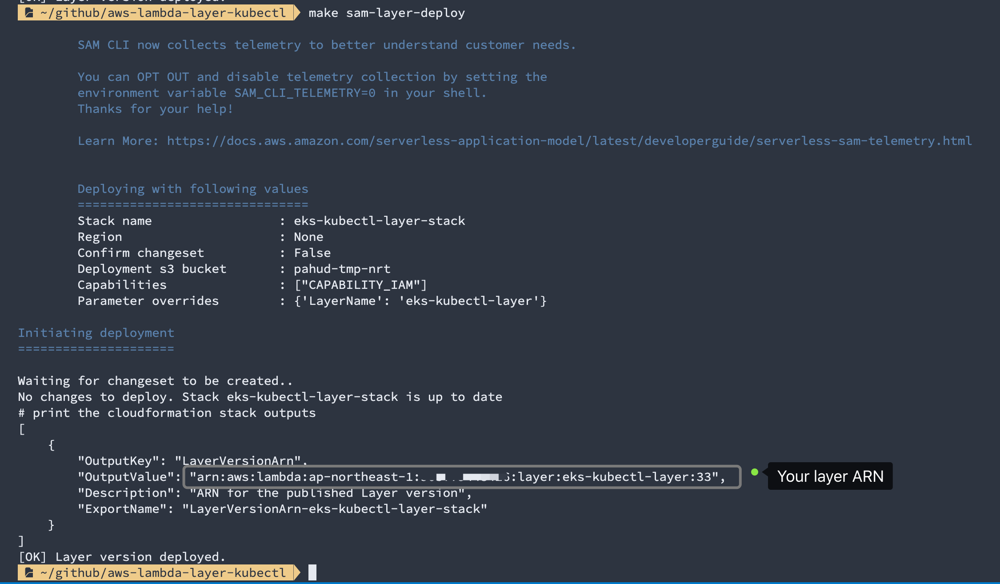
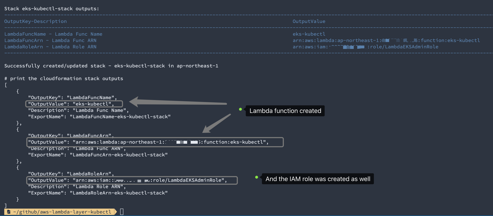

[](https://serverlessrepo.aws.amazon.com/applications/arn:aws:serverlessrepo:us-east-1:903779448426:applications~lambda-layer-kubectl)


# lambda-layer-kubectl

**aws-lambda-layer-kubectl** is an [AWS Lambda Layer](https://docs.aws.amazon.com/en_us/lambda/latest/dg/configuration-layers.html) that encapsulates all the required assets to interact with **Amazon EKS** control plane and help you directly **`kubectl`** against Amazon EKS in AWS Lambda.


## Features

- [x] Ships all the required assests including **kubectl**, **aws-cli**, **make** and **jq** Just include the layer and you get everything required.
- [x] **Helm 3** included.
- [x] Amazon EKS authentication under the hood on bootstrap.


## Current Version

| kubectl      | v1.14.7-eks-1861c5     |
| :----------- | :----------- |
| **awscli**   | **1.17.13** |
| **helm**     | **3.0.3**    |
| **jq**       | **1.6**      |
| **GNU Make** | **3.82**     |


## Layer structure

You got the layer structure as below under `/opt` in lambda custom runtime:

```
.
├── awscli
│   ├── PyYAML-5.1.2-py2.7.egg-info
│   ├── aws
│   ├── awscli
│   ├── awscli-1.16.292-py2.7.egg-info
│   ├── bin
│   ├── botocore
│   ├── botocore-1.13.28-py2.7.egg-info
│   ├── colorama
│   ├── colorama-0.4.1-py2.7.egg-info
│   ├── concurrent
│   ├── dateutil
│   ├── docutils
│   ├── docutils-0.15.2-py2.7.egg-info
│   ├── easy_install.py
│   ├── easy_install.pyc
│   ├── futures-3.3.0-py2.7.egg-info
│   ├── jmespath
│   ├── jmespath-0.9.4-py2.7.egg-info
│   ├── jq
│   ├── make
│   ├── pkg_resources
│   ├── pyasn1
│   ├── pyasn1-0.4.8-py2.7.egg-info
│   ├── python_dateutil-2.8.0-py2.7.egg-info
│   ├── rsa
│   ├── rsa-3.4.2-py2.7.egg-info
│   ├── s3transfer
│   ├── s3transfer-0.2.1-py2.7.egg-info
│   ├── six-1.13.0-py2.7.egg-info
│   ├── six.py
│   ├── six.pyc
│   ├── urllib3
│   ├── urllib3-1.25.7-py2.7.egg-info
│   ├── wheel
│   ├── wheel-0.29.0.dist-info
│   └── yaml
├── helm
│   └── helm
└── kubectl
    └── kubectl

32 directories, 9 files
```


## Supported Lambda Runtime

| lambda runtime | runtime attribute name in CFN/SAM | Remarks                                                      |
| -------------- | --------------------------------- | ------------------------------------------------------------ |
| Custom Runtime | provided                          | you need bundle the bootstrap in your lambda function bundle([example](https://github.com/aws-samples/aws-lambda-layer-kubectl/blob/master/samples/create-k8s-objects/bootstrap)) |


# HOWTO

You may install the Layer from `SAR` or just build it from scratch.


## OPTION #1 - Install from SAR(Serverless App Repository)

This is the recommended approach. We deploy the kubectl lambda layer straight from `SAR(Serverless App Repository)`

You may deploy it from the console, AWS CDK or CLI.

### Deploy from SAR console

|        Region        |                    Click and Deploy                     |
| :----------------: | :----------------------------------------------------------: |
|  **ap-northeast-1**  |[](https://deploy.serverlessrepo.app/ap-northeast-1/?app=arn:aws:serverlessrepo:us-east-1:903779448426:applications/lambda-layer-kubectl)|
|  **ap-east-1**  |[](https://deploy.serverlessrepo.app/ap-east-1/?app=arn:aws:serverlessrepo:us-east-1:903779448426:applications/lambda-layer-kubectl)|
|  **ap-northeast-2**  |[](https://deploy.serverlessrepo.app/ap-northeast-2/?app=arn:aws:serverlessrepo:us-east-1:903779448426:applications/lambda-layer-kubectl)|
|  **ap-northeast-3**  |[](https://deploy.serverlessrepo.app/ap-northeast-3/?app=arn:aws:serverlessrepo:us-east-1:903779448426:applications/lambda-layer-kubectl)|
|  **ap-south-1**  |[](https://deploy.serverlessrepo.app/ap-south-1/?app=arn:aws:serverlessrepo:us-east-1:903779448426:applications/lambda-layer-kubectl)|
|  **ap-southeast-1**  |[](https://deploy.serverlessrepo.app/ap-southeast-1/?app=arn:aws:serverlessrepo:us-east-1:903779448426:applications/lambda-layer-kubectl)|
|  **ap-southeast-2**  |[](https://deploy.serverlessrepo.app/ap-southeast-2/?app=arn:aws:serverlessrepo:us-east-1:903779448426:applications/lambda-layer-kubectl)|
|  **ca-central-1**  |[](https://deploy.serverlessrepo.app/ca-central-1/?app=arn:aws:serverlessrepo:us-east-1:903779448426:applications/lambda-layer-kubectl)|
|  **eu-central-1**  |[](https://deploy.serverlessrepo.app/eu-central-1/?app=arn:aws:serverlessrepo:us-east-1:903779448426:applications/lambda-layer-kubectl)|
|  **eu-north-1**  |[](https://deploy.serverlessrepo.app/eu-north-1/?app=arn:aws:serverlessrepo:us-east-1:903779448426:applications/lambda-layer-kubectl)|
|  **eu-west-1**  |[](https://deploy.serverlessrepo.app/eu-west-1/?app=arn:aws:serverlessrepo:us-east-1:903779448426:applications/lambda-layer-kubectl)|
|  **eu-west-2**  |[](https://deploy.serverlessrepo.app/eu-west-2/?app=arn:aws:serverlessrepo:us-east-1:903779448426:applications/lambda-layer-kubectl)|
|  **eu-west-3**  |[](https://deploy.serverlessrepo.app/eu-west-3/?app=arn:aws:serverlessrepo:us-east-1:903779448426:applications/lambda-layer-kubectl)|
|  **me-south-1**  |[](https://deploy.serverlessrepo.app/me-south-1/?app=arn:aws:serverlessrepo:us-east-1:903779448426:applications/lambda-layer-kubectl)|
|  **sa-east-1**  |[](https://deploy.serverlessrepo.app/sa-east-1/?app=arn:aws:serverlessrepo:us-east-1:903779448426:applications/lambda-layer-kubectl)|
|  **us-east-1**  |[](https://deploy.serverlessrepo.app/us-east-1/?app=arn:aws:serverlessrepo:us-east-1:903779448426:applications/lambda-layer-kubectl)|
|  **us-east-2**  |[](https://deploy.serverlessrepo.app/us-east-2/?app=arn:aws:serverlessrepo:us-east-1:903779448426:applications/lambda-layer-kubectl)|
|  **us-west-1**  |[](https://deploy.serverlessrepo.app/us-west-1/?app=arn:aws:serverlessrepo:us-east-1:903779448426:applications/lambda-layer-kubectl)|
|  **us-west-2**  |[](https://deploy.serverlessrepo.app/us-west-2/?app=arn:aws:serverlessrepo:us-east-1:903779448426:applications/lambda-layer-kubectl)|
|  **cn-north-1**  |[](https://console.amazonaws.cn/lambda/home?region=cn-north-1#/create/app?applicationId=arn:aws-cn:serverlessrepo:cn-north-1:937788672844:applications/lambda-layer-kubectl)|
|  **cn-northwest-1**  |[](https://console.amazonaws.cn/lambda/home?region=cn-northwest-1#/create/app?applicationId=arn:aws-cn:serverlessrepo:cn-north-1:937788672844:applications/lambda-layer-kubectl)|


### Deploy with AWS CDK

```js
import cdk = require('@aws-cdk/core');
import sam = require('@aws-cdk/aws-sam');
import lambda = require('@aws-cdk/aws-lambda');

// Keep the class name stable please
export class AppStack extends cdk.Stack {
    constructor(scope: cdk.Construct, id: string, props?: cdk.StackProps) {
        super(scope, id, props);
    
        const samApp = new sam.CfnApplication(this, 'SamLayer', {
          location: {
            applicationId: 'arn:aws:serverlessrepo:us-east-1:903779448426:applications/lambda-layer-kubectl',
            semanticVersion: '2.0.0-beta2'
          },
          parameters: {
            LayerName: `${this.stackName}-kubectl-layer`
          }
        })

      const layerVersionArn = samApp.getAtt('Outputs.LayerVersionArn').toString();
      new cdk.CfnOutput(this, 'LayerVerionArn', { value: layerVersionArn })

    }
}
```

or play with it at https://play-with-cdk.com?s=99acb08caf74fc982ebfa931da476888


### Deploy with AWS CLI

Alternatively, you may deploy it with AWS CLI.


```sh
$ APP_ID='arn:aws:serverlessrepo:us-east-1:903779448426:applications/lambda-layer-kubectl'

$ LATEST_VERSION=$(aws serverlessrepo get-application --application-id ${APP_ID} --query 'Version.SemanticVersion' --output text)

$ aws --region ${REGION_CODE_TO_DEPLOY} serverlessrepo create-cloud-formation-template \
--application-id  ${APP_ID} \
--semantic-version ${LATEST_VERSION}

{
    "Status": "PREPARING", 
    "TemplateId": "89be5908-520b-4911-bde7-71bf73040e47", 
    "CreationTime": "2019-02-20T14:51:56.826Z", 
    "SemanticVersion": "...", 
    "ExpirationTime": "2019-02-20T20:51:56.826Z", 
    "ApplicationId": "arn:aws:serverlessrepo:us-east-1:903779448426:applications/lambda-layer-kubectl", 
    "TemplateUrl": "..."
}
```
(change `REGION_CODE_TO_DEPLOY` to the region code to deploy this layer(e.g. `ap-northeast-1` or `us-west-2`)


Copy the `TemplateUrl` value and deploy with `cloudformation create-stack`


```sh
aws --region ${REGION_CODE_TO_DEPLOY} cloudformation create-stack --template-url {TemplateUrl} --stack-name {StackName} --capabilities CAPABILITY_AUTO_EXPAND \
--parameter ParameterKey=LayerName,ParameterValue=lambda-layer-kubectl
```

On stack create complete, get the stack outputs as below

```sh
$ aws --region ${REGION_CODE_TO_DEPLOY} cloudformation describe-stacks --stack-name {StackName} --query 'Stacks[0].Outputs'
[
    {
        "Description": "ARN for the published Layer version", 
        "ExportName": "LayerVersionArn-{StackName}", 
        "OutputKey": "LayerVersionArn", 
        "OutputValue": "arn:aws:lambda:ap-northeast-1:123456789012:layer:lambda-layer-kubectl:1"
    }
]
```


Now you got your own private Lambda Layer Arn for `lambda-layer-kubectl`.


## OPTION #2 - Build from scratch

1. check out this repository 

```sh
$ curl -L -o lambda-layer-kubectl.zip https://github.com/pahud/lambda-layer-kubectl/archive/master.zip
$ unzip lambda-layer-kubectl.zip
$ cd lambda-layer-kubectl-master
```

or just 

```sh
$ git clone https://github.com/aws-samples/aws-lambda-layer-kubectl.git
```

2. build the `layer.zip` bundle


```sh
# build the layer locally and bundle everything into a layer.zip file
$ make build
```

(this may take a moment to complete)


3. edit the `Makefile`

| Name                 | Description                                                  | required to update |
| -------------------- | ------------------------------------------------------------ | ------------------ |
| **LAYER_NAME**       | Layer Name                                                   |                    |
| **LAYER_DESC**       | Layer Description                                            |                    |
| **INPUT_JSON**       | input json payload file for lambda invocation                |                    |
| **S3BUCKET**         | Your S3 bucket to store the intermediate Lambda bundle zip.<br />Make sure the S3 bucket in the same region with your Lambda function to deploy. | YES                |
| **LAMBDA_REGION**    | The region code to deploy your Lambda function               |                    |
| **LAMBDA_FUNC_NAME** | Lambda function name                                         |                    |
| **LAMBDA_ROLE_ARN**  | Lambda IAM role ARN                                          | YES                |


### Required Policy for Lambda IAM Role

Please note your IAM role for Lambda will need `eks:DescribeCluster` as well as other ec2 read-only privileges depending on what you intend to do in your Lambda function. You may attach an inline policy as below to your Lambda IAM role.

```js
{
    "Version": "2012-10-17",
    "Statement": [
        {
            "Sid": "VisualEditor0",
            "Effect": "Allow",
            "Action": [
                "ec2:DescribeInstances",
                "ec2:DescribeTags",
                "eks:DescribeCluster"
            ],
            "Resource": "*"
        }
    ]
}
```


4. Deploy the Layer

```sh
# deploy and publish the layer.zip as a layer version
$ make sam-layer-deploy
```

This will deploy the `layer.zip` and publish as a new layer version. 




OK. Now your layer is ready.

Please copy the value of `OutputValue`.


## Build and Publish your Layer to SAR(Serverless App Repository)

publish to SAR in `us-east-1` for AWS global regions
```bash
$ AWS_PROFILE={PORFILE_NAME} LAMBDA_REGION=cn-north-1 S3BUCKET={YOUR_STAGING_BUCKET} SAR_APP_NAME={YOUR_SAR_APP_NAME} make publish-new-layerversion-to-sar
```

This will publish your layer as `{YOUR_SAR_APP_NAME}` to SAR(Serverless App Repository). You can optionally make it public in your SAR console.

## Note for AWS China regions

publish to SAR in `cn-north-1` for AWS China regions
```bash
$ AWS_PROFILE={PORFILE_NAME} LAMBDA_REGION=cn-north-1 S3BUCKET={YOUR_STAGING_BUCKET} SAR_APP_NAME={YOUR_SAR_APP_NAME} make publish-new-layerversion-to-sar-cn
```

If you have successfully published to `cn-north-1` in AWS China region, the SAR URL would be:
```
https://console.amazonaws.cn/serverlessrepo/home?region=cn-north-1#/published-applications/arn:aws-cn:serverlessrepo:cn-north-1:{AWS_ACCOUNT_ID}:applications~lambda-layer-kubectl
```


## Write your first Lambda function with the `kubectl` lambda layer


Now your kubectl layer is ready, you can write a Lambda function with custom runtime to run a bash script and execute the `kubectl` executable provided from the layer.

Behind the scene, the Lambda custom runtime will execute the `bootstrap` executable to generate `kubeconfig` automatically(see [details](https://github.com/aws-samples/aws-lambda-layer-kubectl/blob/8add6c3b7aa733c8ed67b89b1882fe2fae73124b/bootstrap#L17-L23)) followed by running the `main.sh` and all we need to is simply implement our logic in the `main.sh`. The following example demonstrates how to deploy a lambda custom runtime with a provided `bootstrap` executable that invokes `main.sh` and we just need to script in `main.sh` to run regular `kubectl` commands.

Let's deploy the provided lambda function sample with the provided Makefile.

prepare the function and populate into `./func.d`
```sh
# copy everything required to ./func.d directory
$ make func-prep
```
you got the following files in `./func.d` directory

```sh
$ tree -L 2 ./func.d/
./func.d/
├── bootstrap
├── libs.sh
└── main.sh

0 directories, 3 files
```

Let's deploy our lambda func with `SAM`. Edit the `sam.yaml` and update your `Layer` ARN to point your deployed layer ARN. This will make sure your Lambda function will include the correct Layer you have previously deployed.

```yaml
 Layers:
        - !Sub "arn:aws:lambda:ap-northeast-1:${AWS::AccountId}:layer:layer-eks-kubectl-layer-stack:2"
```
See https://github.com/aws-samples/aws-lambda-layer-kubectl/blob/5963abf5ba94cf0c4298675ae8cbfd2569c81873/sam.yaml#L22


Let's say if our EKS cluster name is `eksnrt`, we'd deploy the function like this:
```sh
$ CLUSTER_NAME=eksnrt make sam-deploy
```



If you check the lambda function you'll see an environment variable `cluster_name=eksnrt` is assigned, which will be processed with `kubectl` in Lambda.


6. Enable Lambda function to call Amazon EKS master API

Update the `aws-auth-cm.yaml` described in [Amazon EKS User Guide - getting started](https://docs.aws.amazon.com/en_us/eks/latest/userguide/getting-started.html). Add an extra `rolearn` section as below to allow your Lambda function map its role as `system:masters` in RBAC.


# Test and Validate

To `kubeclt get nodes`, `kubectl get pods` or `kubectl apply -f REMOTE_URL` just edit `main.sh`as below


```sh
#!/bin/bash
# pahud/lambda-layer-kubectl for Amazon EKS

# include the common-used shortcuts
source libs.sh

# with shortcuts(defined in libs.sh)
echo "[INFO] listing the nodes..."
get_nodes

echo "[INFO] listing the pods..."
get_pods

# or go straight with kubectl
echo "[INFO] listing the nodes..."
kubectl get no

echo "[INFO] listing the pods..."
kubectl get po

# to specify different ns
echo "[INFO] listing the pods..."
kubectl -n kube-system get po

# kubectl apply -f REMOTE_URL
kubectl apply -f http://SOME_REMOTE_URL

# kubectl delete -f REMOTE_URL
kubectl delete -f http://SOME_REMOTE_URL

exit 0
```

And publish your function again

```sh
$ CLUSTER_NAME=eksnrt make func-prep sam-deploy
```

Invoke

```sh
$ INPUT_YAML=nginx.yaml make invoke
```

Response


To pass through the local `yaml` file to lambda and execute `kubectl apply -f`


```sh
#!/bin/bash
# pahud/lambda-layer-kubectl for Amazon EKS

# include the common-used shortcuts
source libs.sh

data=$(echo $1 | jq -r .data | base64 -d)

echo "$data" | kubectl apply -f - 2>&1

exit 0
```


Update the function

```sh
$ CLUSTER_NAME=eksnrt make func-prep sam-deploy
```


Invoke

```sh
$ INPUT_YAML=nginx.yaml make invoke
```

Response


To specify different `cluster_name` with the default one in environment variable:

```sh
$ CLUSTER_NAME="another_cluster_name" INPUT_YAML=nginx.yaml make invoke
```


kubectl apply -f `REMOTE_URL` like this

```sh
$ INPUT_YAML_URLS="URL1 URL2 URL3" make invoke
```

e.g.


I hope you find it useful and have fun with this project! Issues and PRs are very appreciated.


# clean up

clean up the function
```sh
$ make sam-destroy
```
clean up the layer
```sh
$ make sam-layer-destroy
```

You're done!


# More Samples
check [samples](./samples) directory


## Cross-Accounts Access

In some cases, you may need cross-account access to different Amazon EKS clusters. The idea is to generate different kubeconfig files and feed the lambda function via environment variables. Check [this sample](https://github.com/aws-samples/aws-lambda-layer-kubectl/issues/3) for more details.


## License Summary

This sample code is made available under the MIT-0 license. See the LICENSE file.
