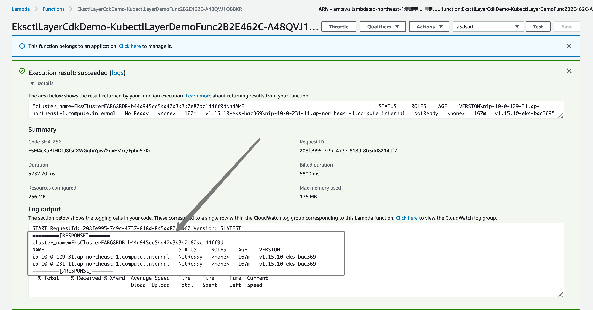

# Deploy this sample with AWS CDK

This sample helps you to provision the following resources in AWS CDK

- Amazon EKS cluster
- kubectl lambda layer
- A sample lambda function with custom runtime with the kubectl lambda layer above


# prepare the `layer.zip`

```bash
$ cd aws-lambda-layer-kubectl
$ make build  # this will generate layer.zip in the project root directory
```

# prepare the `func-bundle.zip`

```bash
$ make func-prep func-zip # this will create func-bundle.zip that includes bootstrap, lib.sh and main.sh
```

# deploy the stack with AWS CDK

Now we have `layer.zip` for the lambda layer and `func-bundle.zip` for the sample function, let's deploy the whole stack with AWS CDK. Make sure you have install AWS CDK CLI in your environment.


```bash
$ cd cdk
$ npm install  # install modules from packages.json
$ cdk diff # see what will be created
$ cdk deploy
```

You will see the output like this

```
Outputs:
EksctlLayerCdkDemo.LambdaFuncName = EksctlLayerCdkDemo-KubectlLayerDemoFunc2B2E462C-A48QVJ1OBBKR
EksctlLayerCdkDemo.EksClusterGetTokenCommandDF0BEDB9 = aws eks get-token --cluster-name EksClusterFAB68BDB-b44a945cc5ba47d3b3b7e87dc144ff9d --region ap-northeast-1 --role-arn arn:aws:iam::112233445566:role/EksctlLayerCdkDemo-EksMasterRole63360845-1PCHOAG0NBYMT
EksctlLayerCdkDemo.LambdaLayerArn = arn:aws:lambda:ap-northeast-1:112233445566:layer:cdkawslambdalayerkubectlD305803A:2
EksctlLayerCdkDemo.EksClusterName = EksClusterFAB68BDB-b44a945cc5ba47d3b3b7e87dc144ff9d
EksctlLayerCdkDemo.EksClusterConfigCommand2AE6ED67 = aws eks update-kubeconfig --name EksClusterFAB68BDB-b44a945cc5ba47d3b3b7e87dc144ff9d --region ap-northeast-1 --role-arn arn:aws:iam::112233445566:role/EksctlLayerCdkDemo-EksMasterRole63360845-1PCHOAG0NBYMT
```

copy and execute the `EksClusterConfigCommand` from the output

```bash
$ aws eks update-kubeconfig --name EksClusterFAB68BDB-b44a945cc5ba47d3b3b7e87dc144ff9d --region ap-northeast-1 --role-arn arn:aws:iam::112233445566:role/EksctlLayerCdkDemo-EksMasterRole63360845-1PCHOAG0NBYMT
```
Response
```
Added new context arn:aws:eks:ap-northeast-1:112233445566:cluster/EksClusterFAB68BDB-b44a945cc5ba47d3b3b7e87dc144ff9d to /Users/pahud/.kube/config
```

kubectl get nodes from the terminal to list the nodes

```bash
$ kubectl get no     
```
Response

```
NAME                                             STATUS     ROLES    AGE    VERSION
ip-10-0-129-31.ap-northeast-1.compute.internal   NotReady   <none>   3h2m   v1.15.10-eks-bac369
ip-10-0-231-11.ap-northeast-1.compute.internal   NotReady   <none>   3h3m   v1.15.10-eks-bac369
```

OK, let's update the `main.sh` for the Lambda function and deploy again

modify the `main.sh` in the project root directory, add one line under `your business logic starting here`

```sh

######## your business logic starting here #############

kubectl get no

exit 0

```

## bundle your function again and re-deploy it

```bash
# in the project root directory
$ make func-prep func-zip && cd cdk; cdk deploy
```

Now go to Lambda console and execute your Lambda function manually and see its output log. You should get the same output with the kubectl command in the terminal.




## To delete this sample stack

```bash
$ cdk destroy
```